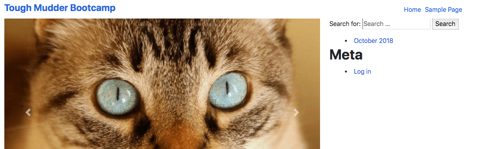
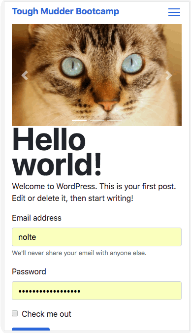

# Header Organism

Atomic element for use with the Lean Theme

[Lean Theme](https://github.com/wearenolte/lean-theme)

## Description
This atomic element is a fixed header that includes a full screen mobile menu triggered with a hamburger button.

## Features
- Desktop logo
- Smaller mobile logo
- Main WP Menu
- Hamburger to open mobile menu
- Full screen mobile menu when active

## Installation
Install dependencies
```bash
npm install hamburgers
```

Add index sass in organisms sass index
```bash
@import 'header/index';
```
Import and call the header function on document ready in the main JS file
```bash
import header from './organisms/header'
...
header()
...
```

## PHP arguments and defaults

$args = wp_parse_args( $args, [
	'class' => '',
	'website-title' => get_bloginfo( 'name' ),
	'logo' => '',
	'logo-mobile' => '',
	'menu-location' => 'main_menu',
]);

## Usage
```php
<?php Load::organisms( 'header/header' ); ?>
```
```php
<?php
Load::organisms( 'header/header', [
	'logo' => get_field( 'logo', 'options' ),
	'logo-mobile' => get_field( 'logo-mobile', 'options' ),
]);
?>
```

## Screenshots

